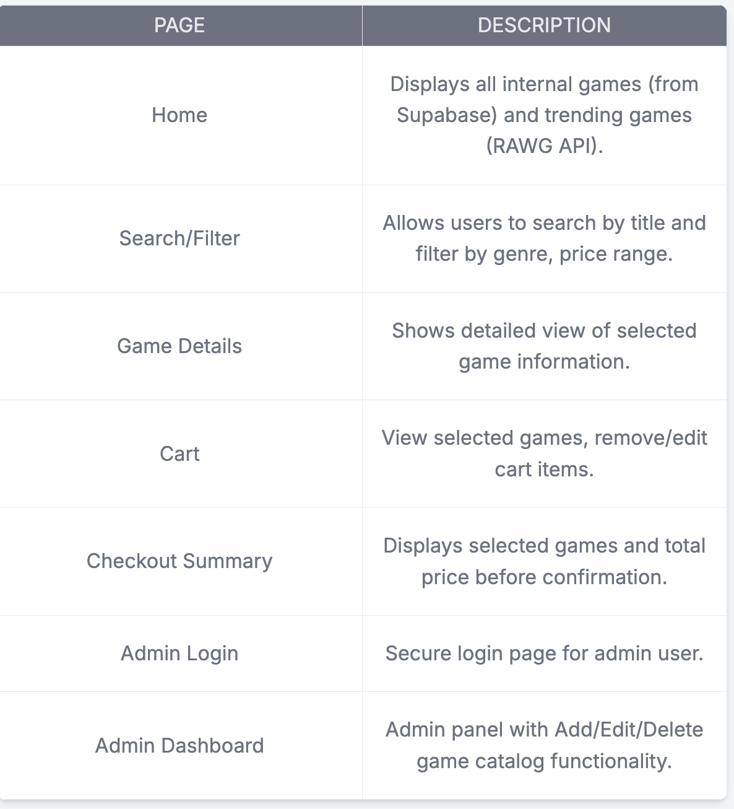
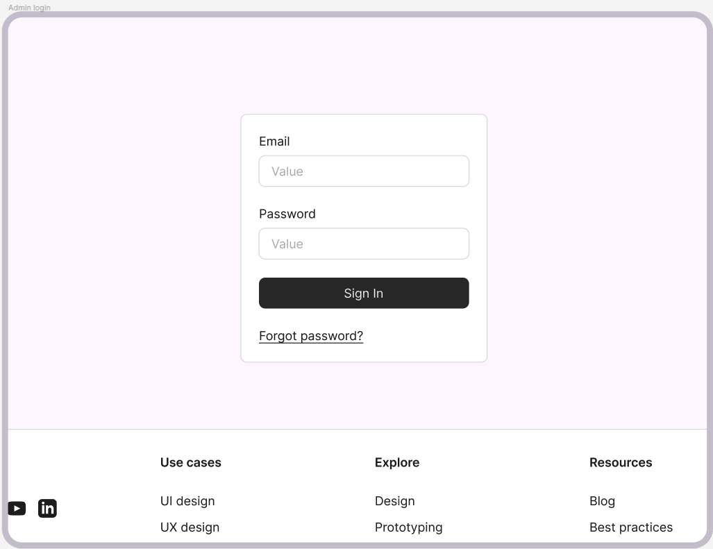
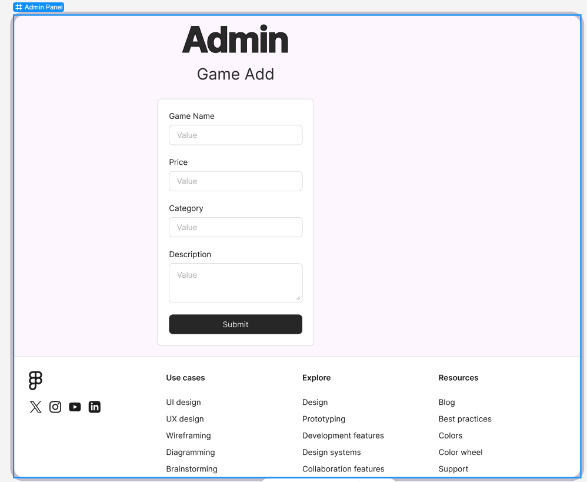
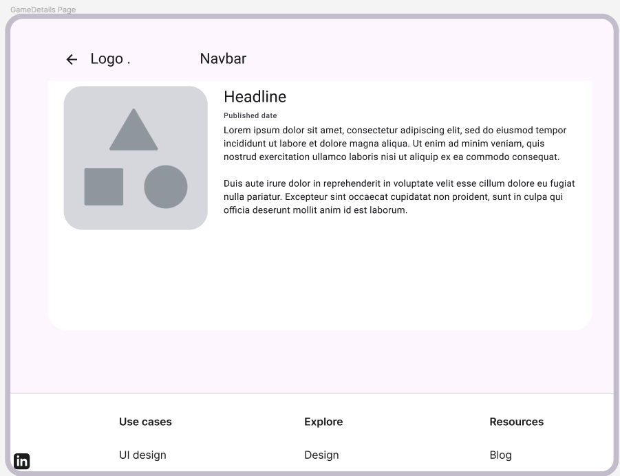
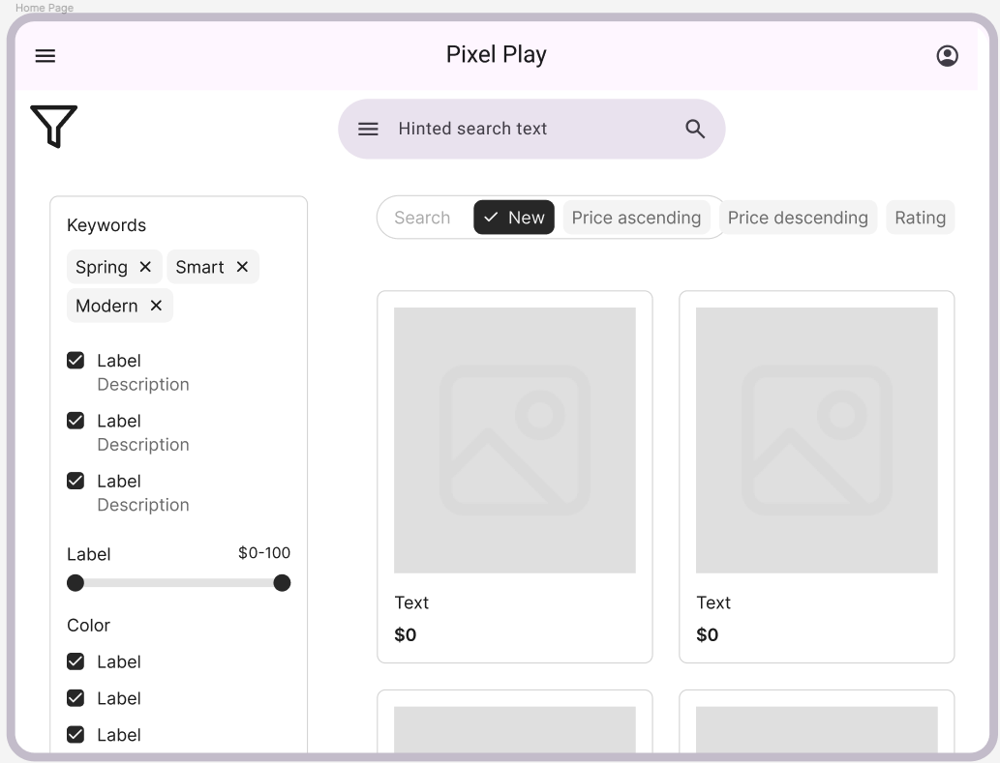
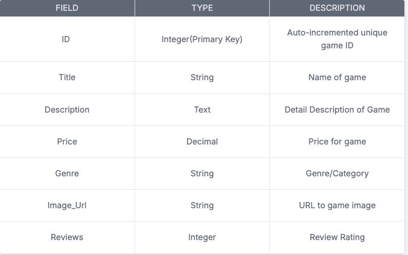
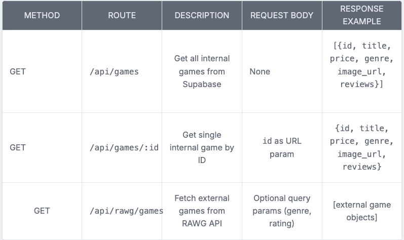
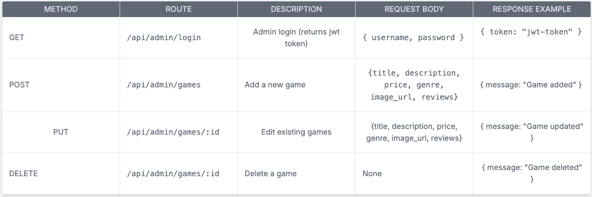
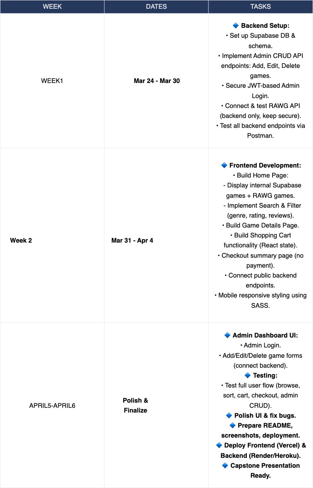

# Project Title

PixelPlay

## Overview

PixelPlay is a full-stack e-commerce web application that allows users to browse, search, and purchase video games. The platform provides a seamless shopping experience for users while also featuring an admin dashboard where administrators can manage the game catalog. PixelPlay integrates both custom-curated game data and external game data fetched from the RAWG API. The project reflects realistic e-commerce patterns and demonstrates full-stack development skills in both client and server architecture, focusing on practical, job-ready technologies.

### Problem Space

Gamers often face disjointed experiences when browsing and purchasing video games across various platforms. PixelPlay solves this by providing:

1.A centralized platform to browse and manage video game listings.

2.A combination of custom-curated game data (via Supabase) and external game data from the RAWG API to offer users a comprehensive catalog.

3.Admin tools to manage a catalog easily, without manual database intervention.

4.A clean,modern responsive UI optimized for gamers, reducing friction in browsing and shopping.

### User Profile

General Users:

Gamers who browse/search for games.
Users who want to view the latest games, detailed information, and add games to their cart.
Users can review their cart and checkout summary before finalizing the order (no payment required).

Admin:

Admin (me) manages the internal game catalog via a secure dashboard.
Admin performs CRUD operations to add, edit, or delete games stored in Supabase.
Admin serves API endpoints that supply game data to the client.

Special Considerations:
-Secure,JWT-based admin authentication to prevent unauthorized access.
-Smooth integration of external RAWG API data without exposing API Keys and other vulnerablties are handled securely
-Clean intuitive,mobile-responsive design,modern gaming aesthetics

### Features

List the functionality that your app will include. These can be written as user stories or descriptions with related details. Do not describe _how_ these features are implemented, only _what_ needs to be implemented.

Core Features:
➸Browse Game Catalog(Supabase Data+ RAWG API)
User can view all games fetched by admin and rawg api endpoints

➸Search&Filter
Search by title,filter by genre,price range and user review stars

➸Game Details Page:
Displays detailed game information: title, description, price, genre, image.

➸Shopping Cart:
Add/remove games.
View Cart with game list and order sumamry
Checkout Summary page shows selected games and total cost

➸Admin Dashbaord:
Secure admin login with JWT
Admin CRUD operations to:
Add new games.
Edit existing games.
Delete games (stored in Supabase)

➸RAWG API Integration:

Fetch and display additional external game data (popular/trending games) dynamically.
Secure API key handling via backend.

## Implementation

### Tech Stack

List technologies that will be used in your app, including any libraries to save time or provide more functionality. Be sure to research any potential limitations.

Frontend :React,SASS
Backend:Nodejs,Express js
Database: Supabase
Authentication:JWT-based admin authentication
External Api:RAWG Api
Deployment:Vercel/Heroku
Dev Tools:Github,Eslint,Postman,Vscode,Zsh

### APIs

List any external sources of data that will be used in your app.

Supabase API :Manage internal curated game using game catalog data
RAWG Video game API:Fetch external popular trending game data dynamically

### Sitemap

List the pages of your app with brief descriptions. You can show this visually, or write it out.

### Mockups

Provide visuals of your app's screens. You can use pictures of hand-drawn sketches, or wireframing tools like Figma.

### Data

Describe your data and the relationships between the data points. You can show this visually using diagrams, or write it out.

One table: games
Each game is managed by the Admin (CRUD).
Data is served via custom API endpoints.

Dynamically fetched; not stored in the database.
Used for listing trending/popular games.
Filtered/sorted client-side (via server-provided secure API).

### Endpoints

## Roadmap

## Future Implementations

Your project will be marked based on what you committed to in the above document. Here, you can list any additional features you may complete after the MVP of your application is built, or if you have extra time before the Capstone due date.

1. User Authentication & Profiles
Implement a complete user authentication system (Signup/Login/Logout) for regular users. Allow users to manage profiles, view order history, and maintain persistent carts across sessions.

2. Payment Gateway Integration
Integrate a secure payment gateway (e.g., Stripe or PayPal) to enable real transactions and complete the checkout process.

3. User Reviews & Ratings
Allow authenticated users to submit reviews and ratings for games. Display average review scores and user comments on each game’s detail page.

4. Wishlist & Favorites
Introduce a Wishlist/Favorites feature, enabling users to save games they are interested in and easily move them to the cart when ready.
