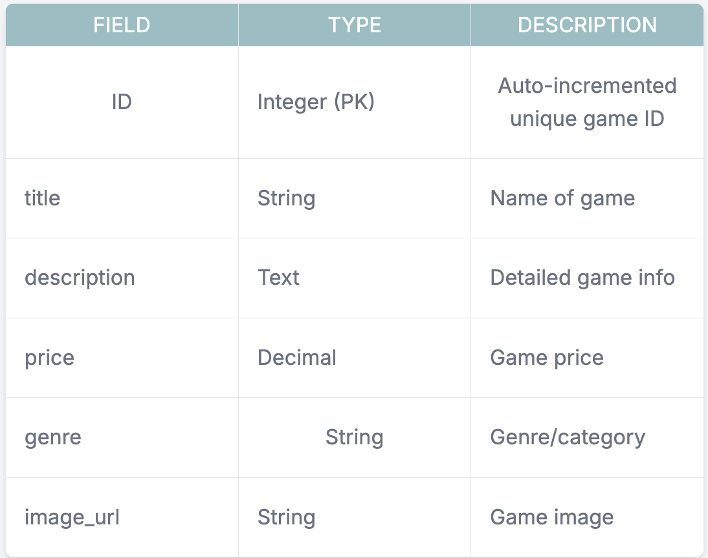
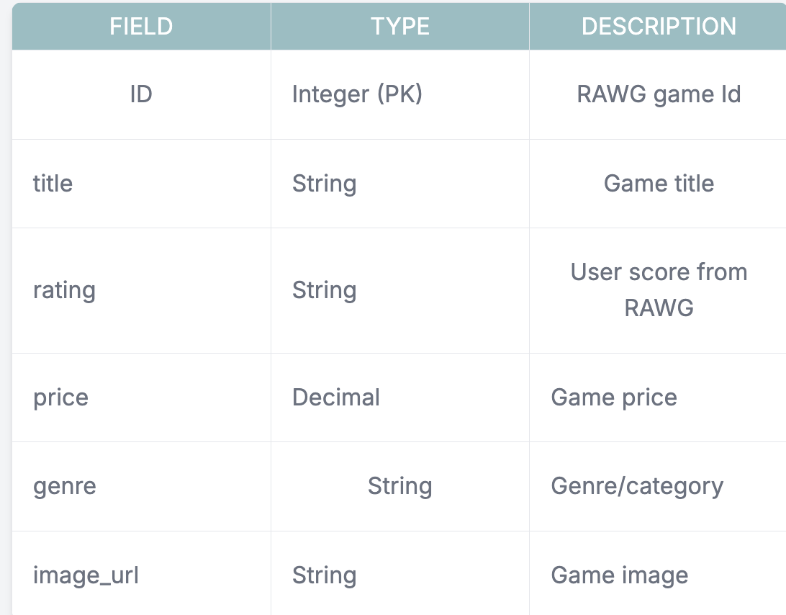
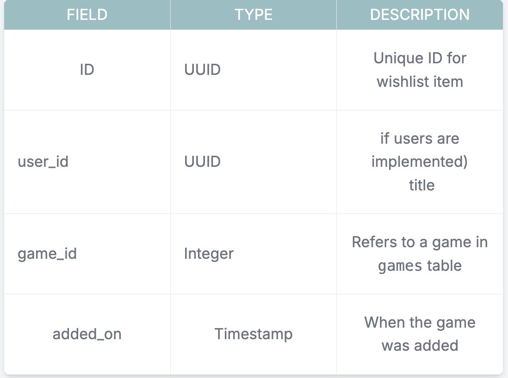

# Project Title

**PixelPlay**

## Overview

PixelPlay is a full-stack web application that allows users to browse, search, and filter a catalog of video games based on their preferences. Users can view detailed information about each game, save games to a personalized wishlist ("Pixel Shelf"), and explore both curated and dynamically fetched content using the RAWG API.

The platform includes an admin dashboard for managing internal game listings through secure CRUD operations. PixelPlay is built with clean, scalable full-stack architecture, showcasing practical, job-ready skills across frontend, backend, database, and third-party API integration.

### Problem Space

Gamers often face disjointed or overwhelming experiences when browsing video games online. Platforms typically prioritize sales over discovery, making it hard for users to track games they’re interested in.

PixelPlay solves this by:

Centralizing curated and external game data for a smoother browsing experience.

Introducing search and filtering features to help users easily find the type of games they want.

Allowing users to save favorite games to a personalized wishlist called the Pixel Shelf for future reference.

Empowering admins to manage the internal catalog seamlessly without direct database access.

### User Profile

🎮 General Users:
Browse and explore games from both curated and external sources.

Search by title and filter games by genre or rating.

View detailed information for each game on a dedicated page.

Save favorite games to their Pixel Shelf wishlist for later.

🛠️ Admin:
Manage internal game listings through a secure admin dashboard.

Perform full CRUD operations (create, read, update, delete) on games stored in Supabase.

Secure access to the dashboard via JWT-based authentication.

**Special Considerations:**

- Smooth integration of external RAWG API data without exposing API Keys and handling vulnerabilities securely.
- Clean, intuitive, mobile-responsive design with modern gaming aesthetics.

### Features

**Core Features:**
➸ Browse Game Catalog (Supabase + RAWG API)
View curated and dynamic game listings, all in one catalog.

➸ Search & Filter Functionality
Search for games by title. Filter by genre or rating to narrow down game discovery.

➸ Game Details Page
Detailed view for each game: title, image, genre, description, rating, and release date.

➸ Pixel Shelf (Wishlist/Favorites)
Users can save games to a personal wishlist, making it easier to revisit interesting titles.

➸ Admin Dashboard
Secure login with full CRUD functionality for managing the curated game catalog.

➸ RAWG API Integration
Display trending/popular games dynamically from the RAWG Video Game Database.

## Implementation

### Tech Stack

Frontend: React, SASS

Backend: Node.js, Express.js

Database: Supabase

Authentication: JWT-based (Admin only)

External API: RAWG Video Game API

Deployment: Vercel (Frontend), Render or Heroku (Backend)

Dev Tools: GitHub, ESLint, Postman, VSCode, Zsh

### APIs

- **Supabase API**: Manage internal curated game catalog.
- **RAWG Video Game API**: Fetch external popular/trending game data dynamically.

### Sitemap

/ → Home page with game listings (Supabase + RAWG)

/search → Search results and filter controls

/game/:id → Game details view

/admin → Admin login

/admin/dashboard → Admin dashboard (CRUD)

/wishlist → User’s Pixel Shelf (wishlist)

### Mockups

### Data

### Endpoints

**Admin Endpoints (Protected)**

POST /api/games → Add new game
GET /api/games/:id → Get game by ID
PUT /api/games/:id → Update game
DELETE /api/games/:id → Delete game

**Public Endpoints**

GET /api/games → Get all internal games
GET /api/games/search → Search/filter internal games
GET /api/rawg/trending → Get external RAWG data (popular games)

**Wishlist Endpoints**

GET /api/wishlist → Get saved games
POST /api/wishlist → Add game to wishlist
DELETE /api/wishlist/:id → Remove game from wishlist

## Roadmap

**Sprint 1 (March 24–28) – Setup & Admin Features**

1.Set up GitHub repo and file structure

2.Initialize React, Node/Express, Supabase schema

3.Create game table and seed data

4.Build Admin Dashboard UI

5.Implement CRUD (add/edit/delete games)

6.Implement JWT-based admin login

**Sprint 2 (March 29–April 2) – User Feature**

1.Build home page with catalog view

2.Integrate RAWG API (popular games)

3.Add search + filter functionality

4.Build Game Details Page

5.Implement wishlist (Pixel Shelf) logic and UI

6.Style entire frontend using SASS

**Sprint 3 (April 3–6) – Polish & Deploy**

1.Final UI polish and bug fixes

2.Responsive design adjustments

3.Deploy backend (Render/Heroku)

4.Deploy frontend (Vercel)

5.Prepare demo flow for presentation

6.Write clean README and documentation

## Future Implementations

1. **User Authentication & Profiles**  
   Allow users to create accounts and persist their wishlist across sessions.

2. **Shopping Cart & Checkout System**  
   Let users simulate game purchases with a cart and order summary.

3. **Payment Gateway Integration**  
   Integrate Stripe/PayPal for real or mock checkout experiences.

4. **User Reviews & Ratings**  
   Enable users to rate and review games after exploring or buying.

5. **Flash Deals / Daily Discounts**
   Gamify the shopping experience with rotating flash game deals.
